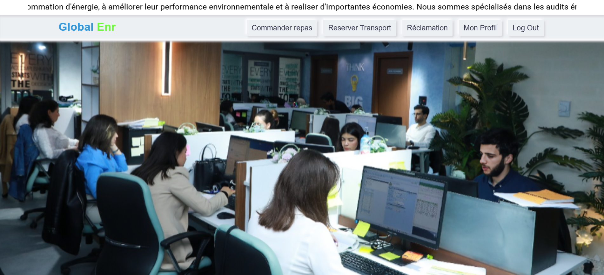

#  GLOBAL ENR – HR Reservation Platform

> A complete local HR management platform that allows employees to reserve their **meals** 🍽️ and **transport** 🚗, while the admin manages and publishes all reservation lists efficiently.

---

##  Dashboard Preview
Here’s a quick look at the main dashboard of **GLOBAL ENR** 👇

---

##  About the Project

**GLOBAL ENR** is a smart internal HR solution designed for companies to simplify and digitalize **employee meal and transport reservations**.

###  Employees can:
- Reserve meals and transport slots  
- Specify time and destination (for transport)  
- View or cancel reservations  

### Admins can:
- Create and publish lists for meals & transport  
- Manage all employee requests  
- Generate summaries or reports  

This system ensures better organization, less manual tracking, and an automated flow between HR and employees.

---

##  Project Architecture

---

##  Tech Stack

| Layer | Technology | Description |
|-------|-------------|-------------|
|  Frontend | Angular, TypeScript | Modern responsive interface |
|  Backend | Node.js, Express | RESTful API |
|  Database | MySQL / PostgreSQL | Data persistence |
|  DevOps | Docker, Jenkins | CI/CD and containerization |
|  Auth | JWT / Local Auth | Secure access |

---

##  Main Features

###  Employee Portal
- Reserve daily meals 
- Book transport (from/to location)  
- Manage upcoming reservations  

### Admin Portal
- Publish available lists (meals & routes)  
- Manage users and bookings  
- Export data for HR reports  

---

##  Run the App Locally (Dockerized)

###  Prerequisites
- Node.js ≥ 18  
- Angular CLI ≥ 17  
- Docker Desktop  
- (Optional) Jenkins for CI/CD

- docker-compose up -d

###  Steps

> ⚠️ **Note:** This code is private and intended for local/internal company use only.  
> ❌ Sorry, it is **forbidden to clone or download the code**.  
> You can still explore the project through this README and screenshots.

 
